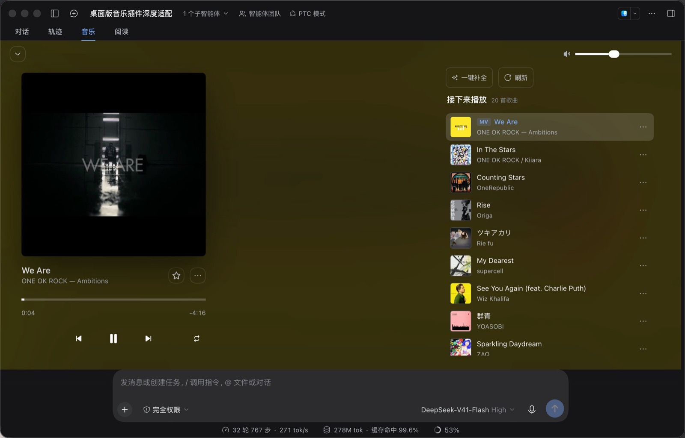
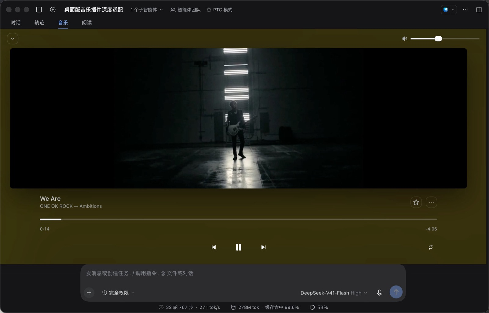

# dsh-music-player

[DeepSeek Harness](https://github.com/deepseek-ai/deepseek-harness)（DSH）的本地音乐播放器插件，**Web 与 Desktop 同一份包**。在会话视图标签环里加一个「音乐」标签页，交互与视觉参考 macOS 的 Music 应用。

**TypeScript 源码 → 提交编译产物**：`src/*.ts` 是唯一真源，`lib/*.js` 是 `tsc` 产物（**也提交**，因为 `dsh plugin add` 不跑构建）。两者一致由门禁保证。





---

## 功能 / Features

- 📁 **库与扫描**：原生目录选择器（macOS / Windows / Linux）或手动粘路径；递归扫描 flac / mp3 / m4a / aac / ogg / opus / wav / mp4 / mov / webm / mkv / avi。实时进度（`n/m`），超 5000 首截断并提示。列表显示歌名 / 歌手 / 时长（内嵌标签解析，缺省回退「歌手 - 歌名」），支持排序与搜索，偏好刷新后记忆
- 🚫 **Apple 离线包（`.movpkg`）整体跳过**：FairPlay 加密的 HLS，任何第三方播放器都无法解密；统计里会说明跳过了几个
- ▶️ **播放**：单曲 / 列表循环（刻意不做随机与歌词页）。**播放顺序 = 可见列表顺序** —— 排序或搜索后「下一首」就是你看到的下一行
- 🎬 **MV 三档判定**：`direct` 直出 / `remux` 换壳 / `transcode` 重编码（参考 Jellyfin），后两档用 ffmpeg，产物缓存到临时目录。**没有 ffmpeg 也能用**：直出格式照常播，其余给安装提示
- 🎛️ **macOS Music 风格控件**：填充式进度条 + 白色胶囊钮，拖拽松手才 seek，滚轮 ±5s（Shift ±1s）。**全屏播放器**带封面取色背景、跑马灯歌名、「接下来播放」队列
- ✨ **在线补全元数据**：每行「✦」打开搜索弹层，宿主并行查 QQ 音乐 + iTunes + 网易云，置信不足时用 MusicBrainz 兜底。打分 = 标题 55% + 歌手 30% + 时长一致性 15%（缺项自动重分配），叠加多源印证与 Live / 翻唱惩罚
- 💾 **写回文件**（默认勾选）：按「歌手 - 原名」重命名并写标签。**封面只补缺失、绝不覆盖已有封面**；只把 jpeg/png 写进文件，补缺取高清规格
- ⭐ **一键补全全部**：逐首限速、进度可见、可随时停止，执行前先弹确认条
- 🖥️ **系统集成**：MediaSession（媒体键、macOS 控制中心 / 锁屏「正在播放」）+ 换曲原生通知；`<audio>` 驻留全局单例，切标签页不中断
- 🔒 **安全边界**：仅接受回环同源请求，跨站 / DNS rebinding 一律 403；封面走主机白名单 + 逐跳校验重定向 + 体积封顶；仅放行栅格格式；`/apply` 串行锁消除 rename 竞态；文件名过滤 Windows 保留设备名；越界路径一律拒绝
- ⚡ **性能**：标签写入在 worker 线程（53MB 文件主线程阻塞 90ms → 1ms）；库轮询复用同一份 payload；数据源连续失败 2 次熔断 60s；匹配并发上限 2

---

## 安装 / Install

前置：已安装 DSH；`pnpm` 在 PATH 上（`dsh plugin` 内部调用它）。

```bash
# 安装 / 更新（更新就是先 remove 再 add）
dsh plugin --profile web add github:heshuren371/dsh-music-player

# 卸载（不会动你的音乐文件）
dsh plugin --profile web remove @local/dsh-music-player
```

装完**重启 `dsh web`** 并刷新页面，标签环出现「音乐」即成功。锁版本加 `#v0.8.5` 后缀。

**DSH Desktop**：桌面 profile 由 Electron 应用独占，CLI 会拒绝写入。请用**应用菜单里的插件管理窗口**安装同一个 GitHub 源，装完重启应用。

---

## 兼容性 / Compatibility

| 项 | 位置 | 值 |
| --- | --- | --- |
| Node.js | `package.json` → `engines.node` | `^22.19.0 \|\| >=24.0.0`（与 DSH 根包声明一致） |
| DSH 范围（描述性） | `dsh.compatibility.dsh` | `>=0.1.6-alpha.1 <0.2.0` |
| DSH 精确记录（证据） | `dsh.compatibility.dshReleases` | `0.1.7-rc.2: compatible`；`0.1.7-rc.1` / `0.1.7-alpha.2`: `unknown` |

**范围 ≠ 证据**：没跑过验收的版本一律写 `unknown`。`install` / `start` / `uninstall` / `rollback` 四项一次性 Profile 证据**尚未提供**。

跨版本接缝变过三处（`dsh.client.platform`、`ctx.webServer` 是否存在、官方图标导出名），插件用**运行时探测 + 双形态回落**处理。**升级 DSH 后请以运行中的应用为准，不要以本地 checkout 为准。**

> 逐条依据、已知断点、技术细节见 [docs/compatibility.md](docs/compatibility.md) 与 [docs/desktop.md](docs/desktop.md)。

---

## 权限与依赖 / Permissions & dependencies

权威值是 `dsh-plugin.json` 的 `permissions` 与 `lib/` 的运行时代码。

| 权限 | 什么时候才会发生 |
| --- | --- |
| `fs.read` | 选定音乐目录后的递归扫描与 Range 流式读取 |
| `fs.write` | 只在「写入标签并重命名文件」流程里 |
| `fs.delete` | 只在删除确认条里点「删除」后，`fs.unlink` **永久删除**（不进废纸篓），仅限当前库内曲目 |
| `net.fetch` | 点「✦」或需要取封面时。全部 HTTPS，**没有任何上传** |
| `transport.api` | 激活时注册 `connection.fetch` 上的精确 `/api/dsh-music/*` 路由 |
| `storage.local` | `$DSH_HOME/storages/dsh-music-player.json` + `localStorage`（`dsh-music:*`） |

`node:child_process` **只**用于调 ffmpeg / ffprobe，参数数组直传、**不经过 shell**。出网主机只有元数据搜索（`c.y.qq.com` / `itunes.apple.com` / `music.163.com` / `musicbrainz.org`）与封面取图（`mzstatic.com` / `*.gtimg.cn` / `*.music.126.net` / `coverartarchive.org`）。读取的环境变量只有 `DSH_HOME` / `DSH_MUSIC_FFMPEG` / `DSH_MUSIC_ITUNES_COUNTRY` / `PATH`。

---

## HTTP API

宿主把每个端点注册为 `ctx.connection.fetch` 上的**精确 `/api` Fetch 路由**（Web 与 Desktop 共用同一条接缝）。**18 个端点**，与 `lib/host.js` 分派表、`lib/index.js` 的 `FETCH_ROUTES`、`dsh-plugin.json` 登记表由门禁强制**三向一致**。

| 路由 | 方法 | 说明 |
| --- | --- | --- |
| `/library` | GET | 当前目录 + 曲目列表（含 `scanning` / `scanTotal` / `truncated`） |
| `/refresh`、`/dir`、`/pick` | POST | 重扫 / 设目录 / 弹原生选择器（`/dir` 体：`{ "dir": "..." }`） |
| `/session` | GET | 下发系统取图用的能力 token 与回环基址 |
| `/stream?p=<id>` | GET | 音频流（Range / 206，越界 403） |
| `/cover?p=<id>` | GET | 内嵌封面（内存缓存，无封面 404） |
| `/match?p=<id>` | GET | 多源匹配候选（`q` 可覆盖搜索词） |
| `/art?u=<url>` | GET | 封面代理（白名单 + 逐跳校验 + 字节封顶 + 缓存） |
| `/apply` | POST | 写标签并按「歌手 - 原名」重命名 |
| `/delete` | POST | 删除曲目**含本地文件**（仅限库内） |
| `/caps` | POST | 上报客户端视频解码能力 |
| `/mv?id=<id>` | GET | MV 播放计划（direct / remux / transcode） |
| `/mvconvert`、`/mvlib`、`/mvfile` | — | 触发转换 / MV 库视图 / MV 文件流（Range） |
| `/system-art?t=<token>`、`/system-stream?t=<token>` | GET | **仅旧前缀可达**：Chromium 内部取封面 / 取媒体 |

> **最后两个为什么不在 `connection.fetch` 上**：它们服务 Chromium **内部**发起的请求（带 `Origin: dsh-app://app`、不带会话 cookie），而平台 `/api` 路由会**先判 Host/Origin 栅栏、再要求浏览器会话**（`admit()`），这类请求必然被拒。**代价**：宿主没有 `webServer` 时（0.1.6 形态）这两个端点不可达 —— 已知限制。
>
> **信任边界**：`/api` 走连接层栅栏 + 浏览器会话；`/dsh-music` 旧前缀走插件自建的等价检查。`system-*` 是栅栏的**显式例外**（靠 URL 里的 token），因此 token 保密性是唯一防线，且它**按用途分签**。

---

## 结构 / Structure

```
src/*.ts           源码（唯一真源）
  index.ts         插件入口（薄壳）：注册 /api/dsh-music/* Fetch 路由 + host 热重载
  http-bridge.ts   Fetch ⇄ node:http 适配层（含流式背压与 HEAD 语义）
  host.ts          宿主：目录扫描 + 标签解析 + Range 流媒体 + 多源匹配 / 封面代理 + 写入与重命名
  client.ts        客户端：conversation.view 槽位注册「音乐」视图（React）
  tagwriter.ts     标签写入 worker 入口（node-taglib-sharp）
lib/*.js           上面 5 个文件的 tsc 产物（提交进仓库；DSH 加载的就是这里）
scripts/           26 套回归 + 静态审计 + 类型棘轮 + 产物新鲜度 + 预览工具
```

---

## 开发与测试 / Development & Tests

```bash
git clone https://github.com/heshuren371/dsh-music-player.git
cd dsh-music-player && pnpm install
pnpm run dev            # = tsc --watch：保存 src/*.ts 即重新编译 lib/*.js
cd .. && dsh plugin --profile web add link:./dsh-music-player
```

**改代码改的是 `src/*.ts`，不是 `lib/*.js`**（后者是产物）。改动生效：`src/client.ts` → 刷新页面；`src/host.ts` → **也是刷新页面**（入口薄壳按 `lib/host.js` 的 mtime 重载）；**只有改 `src/index.ts` 才需要重启进程**。

```bash
pnpm run build          # src/*.ts → lib/*.js
pnpm run typecheck      # 类型棘轮：错误数只许变少（基线 0）
npm test                # 产物新鲜度 + 逐文件严格 + 26 套回归
pnpm run check:manifest # dsh-plugin.json 对 pinned dsh-std Community v0.15 校验
```

CI（[.github/workflows/ci.yml](.github/workflows/ci.yml)）在每次 push / PR 上跑同一组，并在 **Windows 之外的干净 Ubuntu runner** 上验证 26 套全绿。**CI 故意不先 build** —— 产物新鲜度门禁只在 `lib/` 未被就地覆盖时才有判别力。

门禁里专门防「**写了但不生效**」的那几条：

| 套件 | 覆盖什么 |
| --- | --- |
| `test-route-consistency` | 分派表 == `FETCH_ROUTES` ∪ 具名旧前缀例外 == manifest 端点表，**三向集合相等** |
| `test-security` | 越界路径、跨站请求、SSRF、封面 MIME 白名单、token 分签与栅栏收窄 |
| `test-mv-seek` | **MV / 音频进度条必须能快进**：源必须是 token 直连的绝对地址；含「平台 `/session` 被 401 时靠回环前缀拿到基址」「源不可 seek 时按症状自愈」「刷新 cue 不得误报无法播放」三个真机故障场景 |
| `test-leak` | 8 次热重载后 fd 不增长、无孤儿子进程、`dispose()` 后 CPU≈0、heap 增长有界 |
| `test-poll-teardown` / `test-teardown-race` / `test-mv-teardown` | 停用后定时器不得自我续期 / 在飞热重载不得复活 / 在飞 ffmpeg 必须被终止 |
| `test-audit` | 死 CSS / 死字典键 / 死方法；每个写盘目标在审计白名单内、凭据不进写盘、每个 mutation 必须过 `authorize()` |
| `check-build-fresh` / `typecheck-ratchet` / `check-strict` | `lib/` 必须逐字节等于 `src/` 的编译结果；类型错误数只许变少；名单里的文件必须过全严格 |

> ⚠️ **没有布局测量能力。** 客户端套件全部跑 jsdom，涉及「位置 / 宽度 / 是否溢出」的结论是靠**伪造 `scrollWidth`/`clientWidth`** 得出的。凡涉及真实盒模型的判断请标注为**未验证**。

---

## 排查 / Troubleshooting

**Desktop 上改了插件看不到效果 / `Cmd+R` 没反应**：Desktop 主窗口**没有绑定任何重新加载快捷键**（应用菜单里只注册了 `toggleDevTools`，没有 `reload` 角色）。按 **`F12`** 打开 DevTools，在 Console 里执行 **`location.reload()`**；或直接重启应用。注意 `src/host.ts` 会热重载自动生效，**`src/client.ts` 必须重载渲染进程** —— 否则会出现「Web 上修好了、Desktop 上还是坏的」。

**看不到「音乐」标签**：① 刷新页面 ② `dsh plugin --profile web ls` 里有 `@local/dsh-music-player` ③ profile 的 `dsh.profile.bundles` 里有包名 ④（link 方式）克隆目录里有 `node_modules/` ⑤ Desktop：装好后重启过应用。

**换歌不出声 / 播放异常**：先确认 token 通路 —— `curl -s -o /dev/null -w '%{http_code}\n' "http://127.0.0.1:<端口>/dsh-music/api/session"`。能力 token 是**进程级**且按用途分签，正常应与宿主实例同寿命。

**通知不弹**：系统设置 → 通知 → DeepSeek Harness 允许通知；关掉专注模式。

**已经用旧的手动方式装过**（改 JSON + 软链）：可以保留，也可以 remove 后重装。目录记录在 `$DSH_HOME/storages/dsh-music-player.json`（旧版本在克隆目录的 `lib/state.json`，首次启动自动迁移）。

---

## 文档 / Docs

| 文档 | 内容 |
| --- | --- |
| [docs/desktop.md](docs/desktop.md) | Desktop 两代宿主形态差异、macOS「通知 / 正在播放」的能力边界、官方组件与图标命名演变、怎么刷新 Desktop 渲染进程 |
| [docs/compatibility.md](docs/compatibility.md) | 兼容性逐条依据、尚未提供的证据、已知断点、依赖与权限信号、失败边界 |
| [AGENTS.md](AGENTS.md) | **改代码前必读**：规范基线、不可协商的规则、可跑门禁、不变量索引、已知陷阱、审计与迭代协议 |
| [docs/audit-ledger.md](docs/audit-ledger.md) | 16 轮审计台账（只追加不删）：每条发现的证据、复现、门禁与状态 |

## License

[MIT](./LICENSE)
