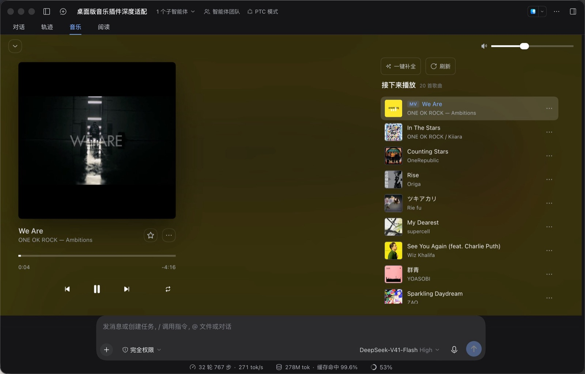
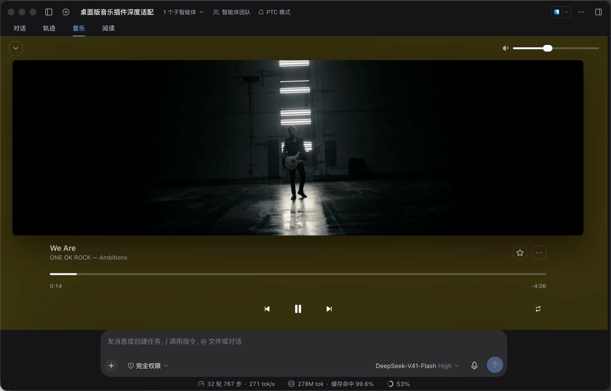

# dsh-music-player

[DeepSeek Harness](https://github.com/deepseek-ai/deepseek-harness)（`dsh`）的本地音乐播放器插件。

它在会话视图的标签环里加一个「音乐」标签页，交互与视觉参考 macOS 的 Music 应用，**Web 与 DSH Desktop 共用同一份包**。宿主侧由 `facets.host.entry` 激活，通过 `ctx.connection.fetch` 注册一组精确的 `/api/dsh-music/*` 路由；客户端通过 `ctx.slots.register` 注册会话视图。

源码用 TypeScript 编写，`lib/` 是 `tsc` 产物并**提交进仓库**（`dsh plugin add` 不执行构建）。





<a id="status"></a>

## 兼容性状态

本插件跟随 DSH 快速迭代。**DSH 升级可能出现破坏兼容性的变更。**

| 项 | 字段 | 值 |
| --- | --- | --- |
| Node.js | `engines.node` | `^22.19.0 \|\| >=24.0.0`（与 DSH 根包声明一致） |
| DSH 范围（描述性） | `dsh.compatibility.dsh` | `>=0.1.6-alpha.1 <0.2.0` |
| DSH 精确记录（证据） | `dsh.compatibility.dshReleases` | `0.1.7-rc.2`: `compatible`；`0.1.7-rc.1` / `0.1.7-alpha.2`: `unknown` |

**范围不等于证据**：没跑过验收的版本一律写 `unknown`。`install` / `start` / `uninstall` / `rollback` 四项一次性 Profile 证据尚未提供。

跨版本接缝变过三处（`dsh.client.platform`、`ctx.webServer` 是否存在、官方图标导出名），插件用运行时探测与双形态回落处理。**升级 DSH 后请以运行中的应用为准，不要以本地 checkout 为准。** 逐条依据与已知断点见 [docs/compatibility.md](docs/compatibility.md)。

<a id="install"></a>

## 安装

安装 `Node.js`，并确保 `pnpm` 在 `PATH` 上（`dsh plugin` 内部调用它），然后运行：

```sh
dsh plugin --profile web add github:heshuren371/dsh-music-player
```

重启 `dsh web` 并刷新页面，会话顶部标签环出现「音乐」即安装成功。锁版本请加 `#v0.8.5` 之类的后缀。

卸载不会动你的音乐文件：

```sh
dsh plugin --profile web remove @local/dsh-music-player
```

更新即先 `remove` 再 `add` 同一条命令。

**DSH Desktop**：桌面 profile 由 Electron 应用独占，CLI 会拒绝写入。请用应用菜单里的插件管理窗口安装同一个 GitHub 源，装完重启应用。

<a id="run-from-source"></a>

### 从源码运行

```sh
git clone https://github.com/heshuren371/dsh-music-player.git
cd dsh-music-player
pnpm install
cd .. && dsh plugin --profile web add link:./dsh-music-player
```

`pnpm run dev`（即 `tsc --watch`）会在源码修改时重建 `lib/`。**改代码改 `src/*.ts`，不要改 `lib/*.js`** —— 后者是产物，`npm test` 会校验两者逐字节一致。

## 功能

- 递归扫描本地目录，支持 flac / mp3 / m4a / aac / ogg / opus / wav / mp4 / mov / webm / mkv / avi；原生目录选择器覆盖 macOS / Windows / Linux，也可手动粘贴路径
- 波形进度条：全屏播放器的进度条上叠**真实包络**（ffmpeg 只读解码取峰值，**不改文件**、内存与曲长无关），一眼看出副歌与静音；取不到波形时**静默退回原来的细轨**
- 均衡器：10 段（31Hz–16kHz）预设曲线（原声 / 流行 / 摇滚 / 古典 / 爵士 / 低音增强 / 人声 / 电子），**自动前级**按最大提升量补偿、不会因提升而削波；也可用 `player.setEqualizer([...])` 自定义曲线。**默认原声**（不动音色）
- 交叉淡化（试验，**默认关闭**）：`?crossfade=1` 或 `window.__dshMusicCrossfade = true` 开启后，切歌时新旧两首**重叠**淡入淡出 —— 消除过渡缝且不牺牲遮蔽力。等确认「电流声」已消失再默认开启
- 单曲循环与列表循环。**播放顺序等于可见列表顺序**，排序或搜索后「下一首」就是你看到的下一行
- 列表显示歌曲名 / 歌手 / 时长；标签与封面来自音频文件内嵌数据，缺省回退「歌手 - 歌名」文件名约定
- MV 三档判定 `direct` / `remux` / `transcode`（参考 Jellyfin），后两档调用 ffmpeg 并把产物缓存在临时目录。**没有 ffmpeg 也能用**：直出格式照常播，其余给出安装提示
- 在线补全元数据：宿主并行查询 QQ 音乐 / iTunes / 网易云，置信不足时用 MusicBrainz 兜底；勾选后写回标签并按「歌手 - 原名」重命名文件
- 一键补全全部：逐首限速、进度可见、可随时停止
- 响度归一化（ReplayGain）：优先读文件内嵌的 `REPLAYGAIN_*` 标准标签；**没有标签的曲目可以用 ffmpeg 测量**（`ebur128`，只读、**不改你的文件**，结果存在插件自己的缓存里）。提供单曲 / 专辑两种模式与前级增益，防削波默认开启；既无标签也未测量的曲目不做任何增益
- 系统集成：MediaSession（媒体键与 macOS 控制中心 / 锁屏「正在播放」）以及换曲原生通知
- Apple 离线包（`.movpkg`）是 FairPlay 加密的 HLS，任何第三方播放器都无法解密，扫描时整体跳过并在统计里说明

刻意不做随机播放与歌词页。全屏播放器带封面取色背景、「接下来播放」队列与跑马灯歌名；播放条与进度条按 macOS Music 重做。切到「对话」再切回音乐时，全屏播放器（含 MV 放大与封面预览）保持原样，不会退回列表页。

## 权限与依赖

权威值是 `dsh-plugin.json` 的 `permissions` 与 `lib/` 的运行时代码。

| 权限 | 触发条件 |
| --- | --- |
| `fs.read` | 选定音乐目录后的递归扫描与 Range 流式读取 |
| `fs.write` | 只在「写入标签并重命名文件」流程里 |
| `fs.delete` | 只在删除确认条里点「删除」后执行，`fs.unlink` **永久删除**（不进废纸篓），且仅限当前库内曲目 |
| `net.fetch` | 点「✦」补全元数据或需要取封面时。全部 HTTPS，**没有任何上传** |
| `transport.api` | 插件激活时注册 `ctx.connection.fetch` 上的精确路由 |
| `storage.local` | `$DSH_HOME/storages/dsh-music-player.json` 与 `localStorage`（`dsh-music:*` 前缀） |

`node:child_process` 只用于调用 `ffmpeg` / `ffprobe`，参数以数组直传、**不经过 shell**。出网主机仅限元数据搜索（`c.y.qq.com` / `itunes.apple.com` / `music.163.com` / `musicbrainz.org`）与封面取图（`mzstatic.com` / `*.gtimg.cn` / `*.music.126.net` / `coverartarchive.org`）。读取的环境变量只有 `DSH_HOME` / `DSH_MUSIC_FFMPEG` / `DSH_MUSIC_ITUNES_COUNTRY` / `PATH`。

## 端点

宿主把 18 个端点注册为 `ctx.connection.fetch` 上的**精确** `/api/dsh-music/*` 路由，Web 与 Desktop 共用同一条接缝。最后一个旧前缀例外、完整的端点表、以及三种通道的信任边界见 [docs/compatibility.md](docs/compatibility.md#9-端点面)。

## 开发

```sh
pnpm run build          # src/*.ts → lib/*.js
pnpm run typecheck      # 类型棘轮：错误数只许变少（基线 0，含死代码开关）
npm test                # 产物新鲜度 + 逐文件严格 + 31 套回归
pnpm run check:manifest # dsh-plugin.json 对 pinned dsh-std Community v0.15 校验
```

改动生效方式：`src/client.ts` 刷新页面；`src/host.ts` 同样是刷新页面（入口薄壳按 `lib/host.js` 的 mtime 热重载）；只有改 `src/index.ts` 才需要重启进程。

CI（[.github/workflows/ci.yml](.github/workflows/ci.yml)）在每次 push 与 PR 上跑同一组门禁。**CI 故意不先 build** —— 产物新鲜度门禁只在 `lib/` 未被就地覆盖时才有判别力。

注意：本仓库**没有布局测量能力**。客户端套件全部跑 jsdom，涉及「位置 / 宽度 / 是否溢出」的结论是靠伪造 `scrollWidth` / `clientWidth` 得出的，请标注为未验证。

面向 agent：请遵循 [AGENTS.md](AGENTS.md)。§0 是给第一次接手本仓库的模型的快速上手。

## 排查

**Desktop 上改了插件看不到效果、`Cmd+R` 没反应**：Desktop 主窗口没有绑定重新加载快捷键（应用菜单里只注册了 `toggleDevTools`，没有 `reload` 角色）。按 `F12` 打开 DevTools，在 Console 里执行 `location.reload()`；或直接重启应用。`src/host.ts` 会热重载自动生效，`src/client.ts` 必须重载渲染进程 —— 否则会出现「Web 上修好了、Desktop 上还是坏的」。

**看不到「音乐」标签**：依次确认页面已刷新、`dsh plugin --profile web ls` 里有 `@local/dsh-music-player`、profile 的 `dsh.profile.bundles` 里有包名、link 方式下克隆目录存在 `node_modules/`；Desktop 需确认装好后重启过应用。

**换歌不出声**：先确认 token 通路，`curl -s -o /dev/null -w '%{http_code}\n' "http://127.0.0.1:<端口>/dsh-music/api/session"` 应返回 200。

**通知不弹**：系统设置 → 通知 → DeepSeek Harness 允许通知；并关闭专注模式。

## 文档

| 文档 | 内容 |
| --- | --- |
| [docs/desktop.md](docs/desktop.md) | Desktop 两代宿主形态差异、macOS「通知 / 正在播放」的能力边界、官方组件与图标命名演变、如何刷新 Desktop 渲染进程 |
| [docs/compatibility.md](docs/compatibility.md) | 兼容性逐条依据、尚未提供的证据、已知断点、依赖、权限与代码信号的对应关系、端点面与信任边界、失败边界 |
| [AGENTS.md](AGENTS.md) | 面向改代码的人与 agent 的强制约定：规范基线、不可协商的规则、可跑门禁、不变量索引、已知陷阱 |
| [docs/audit-ledger.md](docs/audit-ledger.md) | 16 轮审计台账，只追加不删：每条发现的证据、复现、门禁与状态 |

## 许可证

[MIT](LICENSE)

第三方依赖及其许可证见 [docs/compatibility.md](docs/compatibility.md#5-运行时依赖npm)。
